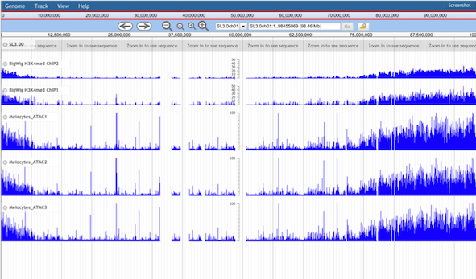
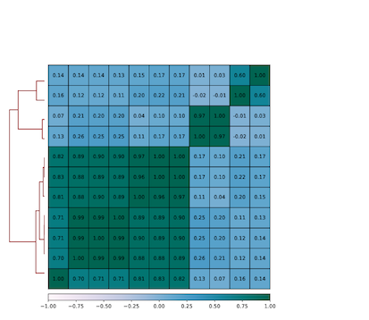
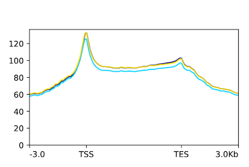

# Summary

Chromatin immunoprecipitation followed by high-throughput sequencing (ChIP-seq) is a powerful tool for investigation the genome-wide distribution of DNA binding protein and their modifications. Yet, the computational analysis of Next-Generation Sequencing datasets is still a bottleneck for most of the experimental researchers. Most often, this type of analysis require multiple steps _i.e._ read quality control, mapping to a reference genome, peak calling, annotation and functional enrichment analysis that are performed by various tools _e.g._ fastp [@Chen:2018], bowtie2 [@Langmead:2012] or samtools [@Li:2009] only to name a few. These various tools require different software dependencies and can have different software versions and/or incompatibilities which might impair the analysis reproducibility. Here we provide a complete, user-friendly and highly customized ChIP-seq analysis pipeline for paired-end (Illumina) data based on the Snakemake workflow manager [@Koster:2012].
   
To make use of the pipeline, only a few modifications are needed. First, software parameters, working and temporary directories as well as genomic references need to be changed in the configuration file (`config.yaml`) that is encoded in the human readable YAML format. Secondly, the user needs to adapt the `units.tsv` tabular file that links sample information to experimental conditions and paired-end fastq files. When these two files are modified, the ChIP-seq pipeline become suitable for any organism from which the genome has been sequenced and annotated. The scalability and reproducibility of the data analysis is ensured by the use of containerization (a Singularity image) and Snakemake through creation and deployment of one virtual environment per rule to manage different software dependencies (_e.g._ Python 2 or 3) using the Conda package manager (https://conda.io) and the Bioconda software distribution channel [@Gruning:2018]. Raw Illumina paired-end data are processed by the pipeline and are subsequently trimmed, mapped and processed automatically according to the parameters set in the configuration file. A complete Directed Acyclic Graph (DAG) of the different tasks accomplished can be seen in ![Figure 1]. If the `singularity` software is available on your machine and you want to use 10 CPUs (`--cores 10`), then run `snakemake --use-conda --use-singularity --cores 10`. Otherwise, run `snakemake --use-conda --cores 10`

The outputs delivered by the pipeline are:  
1. Quality controls files to check for the quality of the reads. Reads are processed by programs such as `fastp` and `deeptools` [@Ramiez:2016] in order to produce graph that are easily readable and inform quickly about the quality of the experiment.
2. Portable visualization files (bigwig) for the observation of the read coverage on the genome using genome viewer **Figure 2**.
3. Peaks informations files, these `bed` files gather the information about the peak calling produced by the MACS2 algorithm. This files can be potentially used for annotation and functional enrichment analysis.
4. The deeptools suite used by the pipeline produces beautiful visualization of the read coverage over genomic features provided by the user and a series of quality control tools **Figure 3 and 4**. 

This Snakemake ChIP-seq analysis pipeline provides an easy to use command-line pipeline requiring minimum modifications with high modularity for domain knowledge input from the user. The source code of this pipeline has been archived to Zenodo with the following linked DOI doi.141444770 [@zenodo].

This pipeline also provides a small subsample of sequencing reads generated from random selection of tomato ChIP-seq data, which could be used to quickly modify and test the pipeline to suit specific requirement from the user.

# Figures
- **Figure 1**: A Directed Acyclic Graph (DAG) of the Snakemake ChIP-seq PE pipeline. This graph has been produced with the command: `snakemake --rulegraph |dot -Tpng > dag.png`

- **Figure 2**: ChIP-seq tracks generated using the pipeline and visualized using JBrowse [@Buels:2016] .
- **Figure 3**: A pearson correlation plot generated by the pipeline using Deeptools to control for the quality of the experiment .
- **Figure 4**: A profile plot showing the distribution of the reads over a selected genomic feature, here the genes .

# Acknowledgements
We acknowledge contributions from Ming Tang and Johannes Koster for their inspired scripts. We would also like to thank the group of RNA biology and applied bioinformatics of the Swammerdam institute for Life sciences for providing the computational ressources, especially Wim de Leeuw and Han Rauwerda. 
This project has been funded by the People Programme (Marie Curie Actions) of the European Union¹s Seventh Framework Programme FP7/2007-2013/ under REA grant agreement n°[606956]13.

# References

